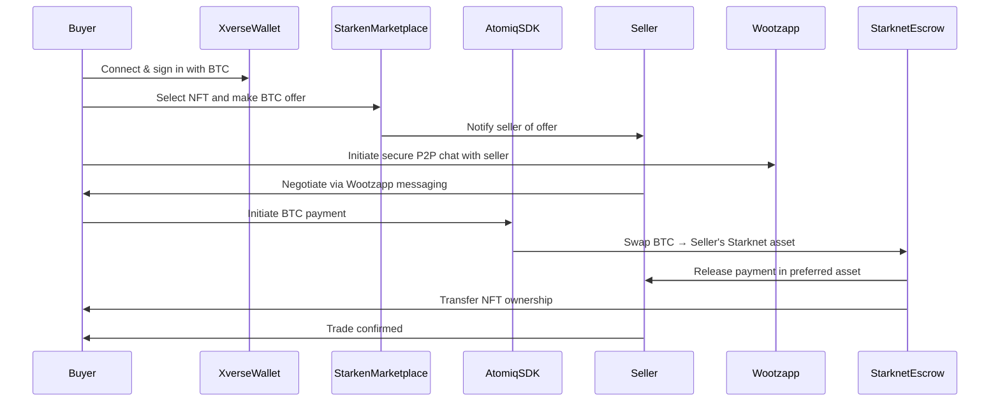

# STARKEN

#### [Demo](https://starken-r92tjpil5-surajmandals-projects.vercel.app/) | [Pitchdeck](https://drive.google.com/file/d/17VyWLW5nHRAjxJPZ4G-sC1vvaEz3aKSv/view?usp=sharing) | [Demo video](https://youtu.be/M9LVRn6zUjs)

## Background

The gaming industry has historically thrived by combining innovation, immersive experiences, and vibrant in-game economies. As gaming transitions into Web3, it introduces digital ownership, decentralized economies, and player-driven ecosystems. However, despite early success, the Web3 gaming sector has faced significant slowdowns, with declining daily active users and stalled projects. At the same time, NFT sales and trading remain resilient, proving that digital assets tied to gameplay continue to hold real economic value.

Starken emerges in this landscape, aiming to revitalize gaming economies through a **next-generation NFT game item P2P marketplace on Starknet Layer 2** with **Bitcoin-based payments** and **messaging-driven negotiation systems**.

## Market

### Current Market Status (Q2 2025)

(Source: [DappRadar Q2 2025 Report](https://dappradar.com/blog/state-of-blockchain-gaming-in-q2-2025))

* Daily unique active wallets: 4.8M (-17% QoQ), lowest since early 2023.
* Inactive game DApps: 300+ (8% of total).
* NFT activity:
  * Metaverse NFT trading volume: -26%
  * Revenue: +54%, showing continued user demand despite lower valuations.
* Investments: \$73M total funding (-20% QoQ, -93% YoY), lowest in 2 years.

### Opportunities

* Web2 gaming companies actively entering Web3.
* NFT-based item trading remains the **core sustainable business model**.
* Transaction similarities between **AI agents** and **game NFTs** open integration potential for future flows.

## Introduction

Starken positions itself at the intersection of Web3 gaming, decentralized finance, and digital ownership. Unlike conventional NFT marketplaces, Starken enables:

* **Ownership-first design:** true custody of assets via Starknet.
* **Cross-chain payments:** BTC swaps through Xverse wallet + Atomiq SDK.
* **Mobile-first UX:** optimized for accessibility and ease of use.
* **Wootzapp-powered P2P Messaging:** enabling secure in-app negotiations, price discussions, and trading tips between buyers and sellers.

This combination addresses the gaps in liquidity, accessibility, and user trust while shaping the **future of NFT-powered in-game economies**.

## Overview

Starken is a **P2P NFT game item marketplace** that:

* Provides **Starknet Layer2 scalability** for cost-efficient trading.
* Accepts **BTC payments via Xverse wallet**, seamlessly swapping into seller-preferred Starknet assets using Atomiq SDK.
* Introduces **community-driven negotiation flows** through direct messaging between buyers and sellers.
* Integrates **future AI-agent transaction flows** in roadmap development, ensuring adaptability to upcoming markets.

## Problem Statement

* Liquidity barriers: Existing game NFT marketplaces often rely on ETH or niche tokens, excluding broader liquidity sources like BTC.
* User onboarding friction: Complicated wallets and transaction steps discourage Web2 users.
* Inactive DApps & trust issues: Failed projects create a credibility gap for players and collectors.
* Limited negotiation tools: Current platforms focus on instant buy/sell, missing human-driven P2P trust-building.

## Solution

Starken solves these by:

* **BTC-first settlement:** enabling payments via Xverse, with on-the-fly swaps to seller’s desired Starknet asset (using Atomiq SDK).
* **Messaging-driven trading:** negotiation layer that combines escrow, secure chat, and settlement.
* **Layer2 performance:** Starknet provides low fees, high throughput, and composability.
* **Mobile-first accessibility:** bringing trading to everyday gamers without steep learning curves.

## Core Features

* Multi-asset settlement: Buyer pays in BTC, seller receives Starknet tokens of choice.
* Wootzapp-powered secure messaging: Buyers and sellers can chat, negotiate prices, and share game insights.
* P2P escrow system: Transactions locked until mutual confirmation.
* Game item interoperability: Items tradable across supported games on Starknet.
* Mobile-native design: intuitive onboarding, Web2-like flows.

## User Flow

* Buyer logs in via Xverse wallet (BTC-enabled).
* Selects NFT item → sends offer in BTC.
* Messaging negotiation between buyer & seller.
* Atomic swap execution: BTC → seller’s preferred Starknet asset.
* Escrow release → NFT transferred to buyer, funds to seller.

## How to Use Tech

* **Cairo contracts (Starknet):** manage listings, escrow, and final settlements.
* **Xverse wallet integration:** Bitcoin-native connectivity.
* **Atomiq SDK:** cross-chain atomic swaps.
* **Wootzapp:** encrypted messaging layer for direct negotiations.

## UX Flow

* Step 1: User onboarding (Xverse wallet + Starknet wallet).
* Step 2: Browse game NFT listings.
* Step 3: Initiate P2P chat with seller via Wootzapp.
* Step 4: Offer BTC → auto-conversion handled in background.
* Step 5: Trade confirmed → NFT + payment exchanged.

## Roadmap

* **Phase 1 (2025 Q4):** Launch MVP with BTC payments, Starknet marketplace core, basic Wootzapp messaging and escrow contracts.
* **Phase 2 (2026 Q1):** Expand supported assets and games, enhance mobile-native UX.
* **Phase 3 (2026 Q2):** Introduce governance mechanisms (DAO-driven), on-chain reputation scores for traders.
* **Phase 4 (2026 Q3):** **AI Agent integration** for automated trading, price recommendations, and fraud detection.

## Business Model & Revenue Streams

* Transaction fee (1-2%) per completed trade.
* Premium services: boosted listings, analytics dashboards.
* Cross-chain swap fees via Atomiq SDK.
* Partnership integrations with Web2 → Web3 gaming studios.

## KPI

* Daily active traders (DAT).
* Gross marketplace volume (GMV).
* BTC-to-Starknet swap volume.
* Retention rate of gamers post-onboarding.
* Average negotiation-to-transaction conversion rate.

## Conclusion

Starken addresses the gaps in current Web3 gaming by combining **BTC liquidity**, **Starknet efficiency**, and **P2P trust layers**. With a mobile-first design, secure negotiation tools, and future AI-agent integration, Starken establishes itself as the **next-generation marketplace for NFT game items**, ensuring sustainable growth in a volatile but high-potential Web3 gaming economy.
